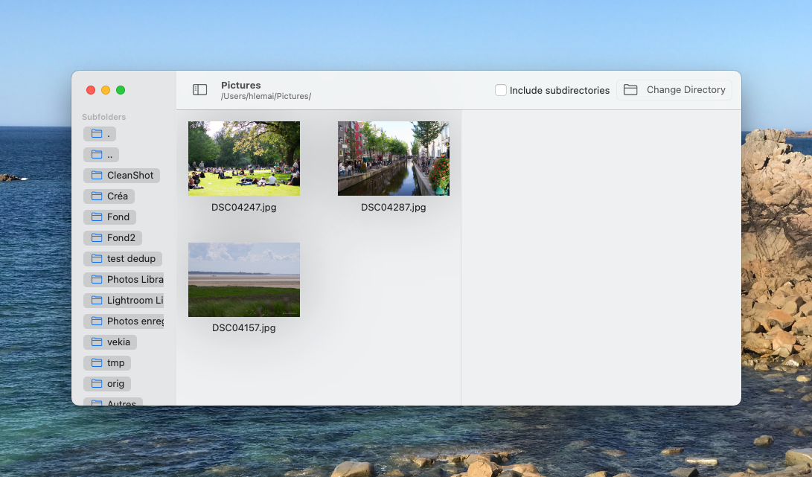
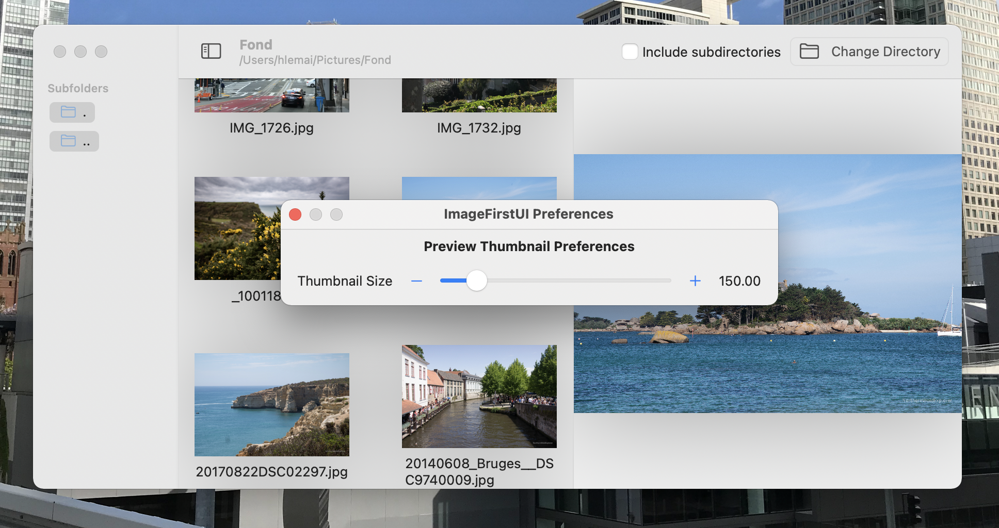

# ImageFirstUI

## Description

Swift UI Sample application used to display image in a directory

Display image of a single directory.
Personal exploraton of MVVM, SwiftUI and others design principles.

Just browse directories, clic on subfolders and on image to diplay.
Can deal with big directories with many files and display many format.

Small preferences and multiple-windows capabilities.

## Piece of interest

You can find some interessing patterns or a good start using swiftui 2.0 :

- **View/ContentView.swift** use NavigationView to navigate between directories.
- **View/DispImgList.swift** is build on top of a LazyVGrid.
- **Model/ImageAndThumbnailLoader.swift** compute asynchronously fresh thumbnail from the whole image and is a combine ObservableObject.

## Licence

no specific licence, you can copy, use translate... 